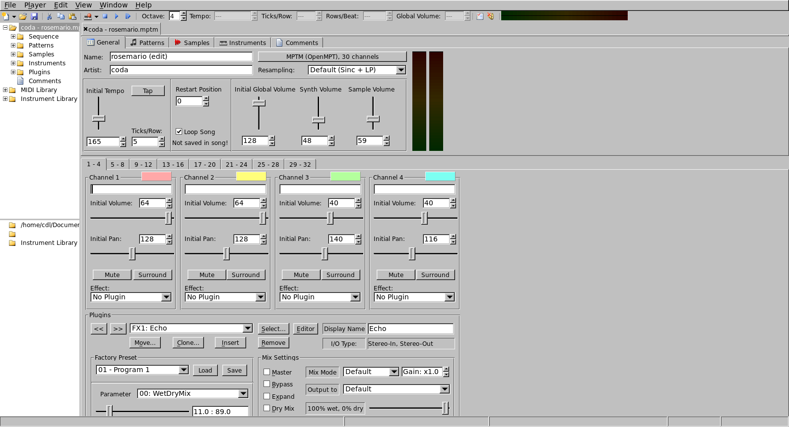
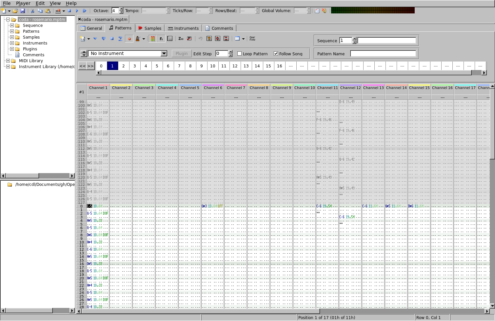

# OpenMPT-FLTK

A port of the OpenMPT Tracker to FLTK, with the intention of having something that works natively on Linux. This is a heavily AI-assisted port with a design chosen to minimize how much code needs to be converted. openmpt and fltk are submodules, with only the GUI code and an 'extension' wrapper around tracker-specific internals has been ported. The actual playback works by linking against libOpenMPT as-is.

This is complicated because libOpenMPT has many editor hooks that are compiled out when built as a library.

Not everything works yet, it's basically proof of concept that the UI can be converted. It can load and play a song, and the custom drawing widgets are converted. Things like exporting does not work yet.

FLTK was chosen because it has that old shool computer vibe and is very lightweight.


## Screenshots

General tab:



Pattern editor:




## Building

Only Linux is tested. The Windows and macOS builds have not been tried yet.

### Dependencies

You need a C++20 compiler (GCC or Clang), CMake 3.16 or newer, Ninja, GNU make, rsync, pkg-config, zlib, ALSA and PulseAudio. You also need the X11/Wayland development packages that FLTK uses. On Debian/Ubuntu:

```
sudo apt install build-essential cmake ninja-build rsync pkg-config \
    zlib1g-dev libasound2-dev libpulse-dev \
    libx11-dev libxext-dev libxft-dev libxinerama-dev libxcursor-dev libxrender-dev libxfixes-dev \
    libwayland-dev wayland-protocols libxkbcommon-dev libdecor-0-dev \
    libpango1.0-dev libcairo2-dev libdbus-1-dev libpng-dev libjpeg-dev
```

See `fltk/README.Unix.txt` for FLTK's full dependency list.

### Compiling

Clone with the submodules:

```
git clone --recurse-submodules https://github.com/not-magic/OpenMPT-FLTK.git
# or, in an existing clone:
git submodule update --init
```

Configure and build. The build type defaults to Debug, so pass `-DCMAKE_BUILD_TYPE=Release` for an optimized build:

```
cmake -S . -B build -G Ninja -DCMAKE_BUILD_TYPE=Release
ninja -C build OpenMPT
```

The executable is written to `build/bin/OpenMPT`. To open a module and start playing it right away:

```
build/bin/OpenMPT -play path/to/module.it
```

The build copies `openmpt/` into `build/libopenmpt-<hash>/` and runs upstream's Makefile there to build libopenmpt, so the first build takes a while.
